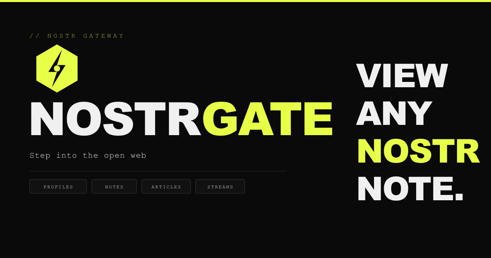

# NostrGate
## Step into the open web
A static, client-side Nostr gateway. Paste any Nostr identifier - a profile, note, article, or live stream, and get a clean preview. Open a gate to any client you prefer.

**[Visit the NostrGate homepage and try it out. nostrgate.com](https://nostrgate.com)**

---

## What it does
NostrGate turns any Nostr identifier into a fully rendered, shareable page. No account, no keys and no forced client choice needed. Profiles, notes, articles and live streams are all viewable by anyone with a browser. It bridges Nostr to the rest of the web in a single HTML file.

**Profiles** come with the full picture - avatar, banner, bio, NIP-05 verification (actually verified against `/.well-known/nostr.json` with live badge status), and a tabbed feed of recent notes and replies you can browse without leaving the page. Mentions in bios link through to other profiles and notes.

**Short notes** are rendered the way they were meant to be read: inline images, embedded video and audio, YouTube embeds, quoted notes that resolve and expand in place, hashtag highlighting, and mentions that link through to the referenced profile or note.

**Long-form articles** get proper markdown treatment - headings, code blocks, images, formatting - so a well-written article actually looks like one.

**Live streams** show the HLS player, current status, stream metadata, and the full participant list with host and speaker roles.

**Zaps** are supported across profiles, notes, and articles. Pick an amount (or enter a custom one), add an optional message, and pay via QR code or your lightning wallet.

Wherever you land, the **client picker** is right there - one click to open the same content in whichever Nostr client you prefer, with smart URL routing for 10+ web clients and native app support via the `nostr:` protocol.

## How it works

NostrGate is a single HTML file. There is no backend. Everything runs in the browser:

1. The identifier is decoded using [nostr-tools](https://github.com/nbd-wtf/nostr-tools)
2. Events and profiles are fetched directly from public Nostr relays via WebSocket
3. Content is rendered client-side and displayed

All fetched data - events, profiles, NIP-05 results - is persisted to **IndexedDB** via a write-through cache, so returning visitors get instant loads without re-fetching from relays. Profile feed state (scroll position, active tab, pagination) is also cached, making back-navigation instantaneous.

NostrGate **prefetches** to keep navigation fast. While you're reading a profile's notes, the next page is already being loaded in the background. Replies are prefetched as soon as the notes tab renders. Quoted note authors and footer profile links are prefetched too, so clicking through feels faster.

## Supported identifiers

| Format | Description |
|--------|-------------|
| `npub1...` | Public key - loads a profile |
| `nprofile1...` | Public key with relay hints |
| `note1...` | Short text note |
| `nevent1...` | Note with relay hints |
| `naddr1...` | Long-form article or live stream |
| `user@domain.com` | NIP-05 address - resolves to a profile |
| `domain.com` | Root NIP-05 - resolves `_@domain.com` |

Identifiers with a `nostr:` prefix are handled automatically.

## Self-hosting

NostrGate is a single HTML file. To self-host, just serve `index.html` from any static host - GitHub Pages, Cloudflare Pages, Netlify or any other. Optionally include `og-image.png` (for social media previews) and `icon.png` (for mobile home screen icons).

## Tech

- Vanilla JS - no build step, no framework
- Single HTML file, zero backend dependencies
- [nostr-tools](https://github.com/nbd-wtf/nostr-tools) (v2.10.4) for NIP-19 encoding/decoding and relay pooling
- [hls.js](https://github.com/video-dev/hls.js) for live stream playback
- [marked](https://github.com/markedjs/marked) (v14.0.0) for long-form article markdown rendering
- [qrcode](https://github.com/soldair/node-qrcode) (v1.5.4) for zap invoice QR codes
- IndexedDB for persistent client-side caching

## Credits

Inspired by [njump](https://github.com/fiatjaf/njump) by [fiatjaf](https://nostrgate.com/#npub180cvv07tjdrrgpa0j7j7tmnyl2yr6yr7l8j4s3evf6u64th6gkwsyjh6w6).

Built by [5t34k](https://nostrgate.com/#npub1x5t34kxd79m657qcuwp4zrypy9t8t4e6yks5zapjvau29t0xvgaqakh2p2).

## License

MIT
